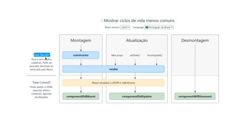

# ** Curso React**
## Capitulo 1 
### Entendendo conceitos básicos: 
#### Babel 
> ****
#### Webpack
> ****
#### Build

### Conceito de estado em React

>> #### Estado
>> - É uma propriedade do componente onde colocamos dados que, quando mudados, devem causar uma nova renderização. Simples assim. Se deve causar mudança fica no estado, se não deve, não fica. 
>> * *Referência*: [**Medium**](https://medium.com/@dimascyriaco_29717/entendendo-o-estado-no-react-ac1e5c32b0c0)

### Conceito de *props* em React

>> #### Props
>> - são utilizadas para passar valores entre componentes. 
>> * *Referência*: [**Medium**](https://medium.com/@dimascyriaco_29717/entendendo-o-estado-no-react-ac1e5c32b0c0)

#### Componentes de classe

        import { Component } from 'react/cjs/react.development';

        class App extends Component{
          render(){
            return <h1>Hello World!!!</h1>
          }
        }
        export default App

 #### Componentes de função

        function App(){
          return(
                

                  <h1>
                  Hello Again
                  </h1>
                

          )
        }
        export default App
  
#### Componentes de classe com estado

        import { Component } from 'react/cjs/react.development';

        class App extends Component{
          constructor(props){
            super(props);
            this.handleClick = this.handleClick.bind(this)//bind(this) insere o contexto de this para dentro da função handleClick, Desta maneira permitindo o acesso da função aos objetos da classe. Para sobrepor este comportamento, use Arrow functions '()=>{}'
            this.state = {
              name: 'Rodrigo',
              surname: "Muniz"
            };
          }
          handleClick(){
            //forma antiga
            // const {name,surname} = this.state
            // console.log(`Clicado ${name}  ${surname}`)

            //Forma nova, com uso de setState
            this.setState({name:"Rodrigo",surname:"Fernandes Muniz"})
          }

          render(){
            const {name,surname} = this.state
            return (
              <h1 onClick={this.handleClick}>Hello, {name} {surname}!!!</h1>
            )
          }
        }
#### Componentes de classe com estado e eventos sintéticos

        import { Component } from "react/cjs/react.development";

        class Counter extends Component{
          constructor(props){
            super(props)
            this.state = {
              counter : 0
            }
          }

          addCounter = ()=>{
            const {counter} = this.state
            const add = counter+ 1
            this.setState({counter: add})
          }
          
          render(){
            return (
              <button onClick={this.addCounter}>{this.state.counter}</button>
            )
          }
        }
        export default Counter

#### State com arrays e objetos

        import { Component } from 'react';
        import './App.css'

        // Componente de class stateless
        class App extends Component{
          state={
            posts:[
                {
                  id:1,
                  title: 'O titulo 1',
                  body: 'O corpo 1'
                },
                {
                  id:2,
                  title: 'O titulo 2',
                  body: 'O corpo 2'
                },
                {
                  id:3,
                  title: 'O titulo 3',
                  body: 'O corpo 3'
                },
              ]
          }
          render(){
            const {posts} = this.state
            return (
            

              {posts.map((post)=>(
                

                  <h1>{post.title}</h1>
                  <h2>{post.body}</h2>
                

              ))}
            

            )
          }
        }

        export default App

## Lifecycle Methods
#### Lifecycle React
> 
#### Utilizando lifecycle method - componentDidMount()
>> Este método é ativado toda vez que o componente for montado(renderizado)

        class App extends Component{
          state={
            posts:[]
          }

          componentDidMount(){
            console.log('Componente montado')
            this.setState({
              posts:[
                {
                  id:1,
                  title: 'O titulo 1',
                  body: 'O corpo 1'
                },
                {
                  id:2,
                  title: 'O titulo 2',
                  body: 'O corpo 2'
                },
                {
                  id:3,
                  title: 'O titulo 3',
                  body: 'O corpo 3'
                },
            ]
            })
          }

#### Data Fetching com lifecycle methods

        import { Component } from 'react';
        import './App.css'

        // Class statefull component
        class App extends Component{
          state={
            posts:[]
          }

          //Lifecycle method
          componentDidMount(){
            this.loadPosts()
          }

          //Fetching data
          loadPosts = async ()=>{
            const postsPromisse = fetch('https://jsonplaceholder.typicode.com/posts')
            const photosPromisse= fetch('https://jsonplaceholder.typicode.com/photos')

            const [posts, photos] = await Promise.all([postsPromisse,photosPromisse])
            const postsJson = await posts.json()
            const photosJson = await photos.json()

            const postsAndPhotos = postsJson.map((post,ind)=>{
              return {...post,cover:photosJson[ind].url}
            })
            this.setState({posts:postsAndPhotos})
          }

          //Render page
          render(){
            const {posts} = this.state
            return (
            

              {posts.map((post)=>(
                

                  
                  <h1>{post.id}- {post.title}</h1>
                  

                  
{post.body}

                

              ))}
            

            )
          }
        }

        export default App